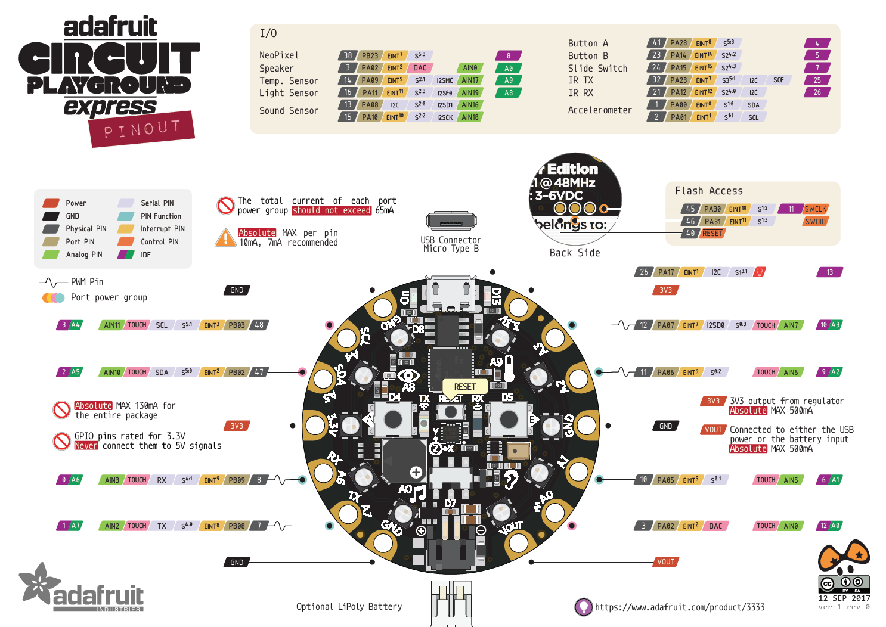

# Indoor-CPE
Repository for all firmware related to the Circuit Playground Express for indoor sensing and control at BVN.

## Instructions to load firmware
### Bootloader
Double tap the reset button (the nepixels should turn, red or green).  
A window should pop up with the CPX file system called `CPLAYBOOT`.

Drag the file in `bootloader` (`adafruit-circuitpython-circuitplayground_express <VERSION>.uf2`

The light will turn off and the CPX should eject and a similar window should pop ip with the CPX file system, this time called `CIRCUITPY`

The bootloader is now loaded!

### CircuitPython Firmware
Copy all contents of `firmware` into the `CIRCUITPY` drive.

## Pinout  

## Corrupt CPX Filesystem
Jump to [here](https://github.com/bvn-architecture/Indoor-CPE/tree/master/utility/Erase%20File) and follow the instructions.

___
# Data Sheets
- [MCU (ATSAMD21)](https://cdn-shop.adafruit.com/product-files/2772/atmel-42181-sam-d21_datasheet.pdf)
- [Ambient Light Sensor](https://cdn-shop.adafruit.com/product-files/2748/2748+datasheet.pdf)
- [PDM mic](https://cdn-learn.adafruit.com/assets/assets/000/049/977/original/MP34DT01-M.pdf)
