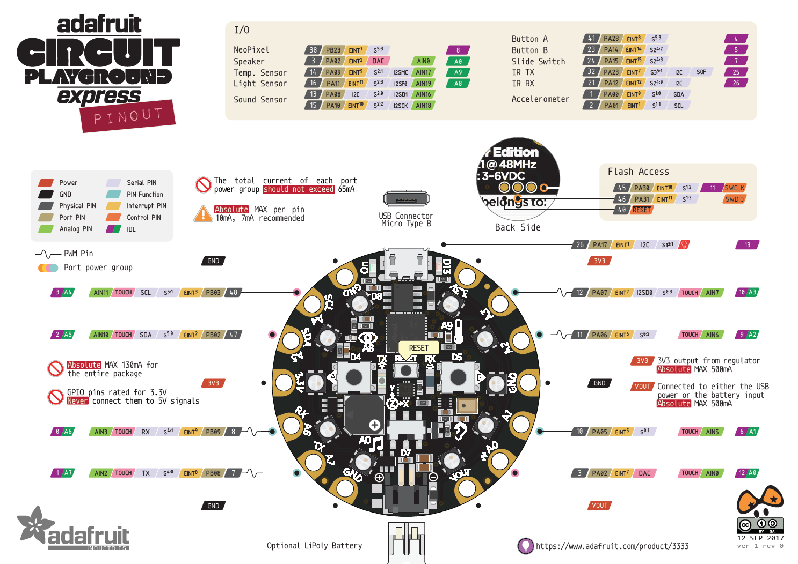

# Firmware for CPE

## Pinout  


## Serial Connection


## Temperature
| Comms/Protocol | Pins | Library | 
| --- | --- | --- |
| Analogue | __A9__ | Inbuilt |
## Sound
| Comms/Protocol | Pins | Library | 
| --- | --- | --- |
| Analogue | I2SD1: 13 I2SCLK: 15 | Adafruit Zero PDM Library |
- 
## Light
| Comms/Protocol | Pins | Library | 
| --- | --- | --- |
| Analogue | __A8__ | Inbuilt |

## LED Display
| Comms/Protocol | Pins | Library | 
| --- | --- | --- |
| Digital or DMA | __8__ | Adafruit Neopixel, Adafruit ZeroDMA, Adafruit Neopixel ZeroDMA |

- digital write timing control
- [DMA](https://learn.adafruit.com/dma-driven-neopixels/overview)
- [NeoPXL8](https://learn.adafruit.com/dma-driven-neopixels/neopxl8)
## Button Control
| Comms/Protocol | Pins | Library | 
| --- | --- | --- |
| Digital | _Button A_: __4__ _Button B_: __5__ | Inbuilt |

## SPI Flash

## Software Reset
- hard reset
- [watchdog timer](https://github.com/adafruit/Adafruit_SleepyDog/blob/master/utility/WatchdogSAMD.cpp)

## Timing 
### Using millis/micros
- Accuracy of millis: 

- ["Metro" timing library](https://github.com/thomasfredericks/Metro-Arduino-Wiring/blob/master/Metro/Metro.cpp)


### Using a library
- [Scheduler](https://www.arduino.cc/en/Reference/Scheduler)
- [ChibiOS]()
### Using system timers

| Timer | Pros | Cons | 
| --- | --- | --- |
| SysTick | portable to other Cortex cpus, high resolution.  Systick is more-or-less designed to generate periodic interrupts in the millisecond range. | 24bit; requires fairly frequent software intervention for long times. |
| RTC | Atmel peripheral designed to more human-scaled times. Calendar mode keeps seconds/minutes/hours/days/month/etc.  Alarm mode.  Runs in assorted low-power modes.  | less portable.   On SAMD21, runs at 32kHz max, so not useful for `micros()`|
| TC and TCC | Atmel fancier Timer peripherals.  many clock and other configuration options.  May be cascadeable.| lesss portable, more complicated.  Usually "reserved" for more complex timer tasks (like PWM) than simple time keeping. |

### Systick
```C
SysTick_Config(F_CPU/SYSTICKS_PER_SECOND);
volatile uint32_t MS_Timer = 0;

void SysTick_Handler(void) {
    // Increment global millisecond timer
    MS_Timer++;                
}

// Set timeout for 20 seconds from now
uint32_t  Timeout = MS_Timer + 20000;  
...
if ((int32_t)((int32_t)MS_Timer - (int32_t)Timeout) >= 0) {
    Timeout += 500;  // Repeat this timeout in 500 milliseconds
    do Whatever...
}

```
examples at [bottom](http://www.avrfreaks.net/forum/atsamd21-millis-or-micros)
___
# Data Sheets
- [MCU (ATSAMD21)](https://cdn-shop.adafruit.com/product-files/2772/atmel-42181-sam-d21_datasheet.pdf)
- [Ambient Light Sensor](https://cdn-shop.adafruit.com/product-files/2748/2748+datasheet.pdf)
- [PDM mic]()